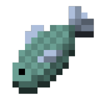

    

<h1> PCL Community 梗图/文收集 </h1>

* * *

### 投递新图/文

本仓库欢迎更多新的梗，如果你有相关的新梗想要加入本仓库，只需要 Fork 后做一些简单更改即可 **√**

当然，也欢迎加入 [PCL Community](https://github.com/PCL-Community) 更方便地进行更改~

> [!IMPORTANT]
> 下面的步骤很重要，请务必仔细阅读。

> 对于**图片**内容参考如下步骤：
>
> 1. 准备图片
>
>    1. 内容应为**与 PCL Community 相关的**梗图
>
>    2. 将文件名命名为你的梗图需要表述的意思
>
> 2. 提交图片
>
>    1. 前往 [Worldhim/PCL2Hub](https://github.com/Worldhim/PCL2Hub) 参考 README 发起 [Pull Request](https://docs.github.com/zh/pull-requests/collaborating-with-pull-requests/proposing-changes-to-your-work-with-pull-requests/creating-a-pull-request) 至 [Worldhim/PCL2Hub](https://github.com/Worldhim/PCL2Hub)
>
>    2. 等待每日一次（UTC+8 6:00）的自动同步或[立即手动同步](https://github.com/PCL-Community/PCLC-Meme/actions/workflows/sync-origin-img.yml)即可
>
>    3. **请不要试图修改 `meme` 文件夹中的内容——它们是自动同步的，对其的修改会在下次同步图片时被覆盖**

> 对于**文字**内容参考如下步骤：
>
> 1. [Fork 本仓库](https://github.com/PCL-Community/PCLC-Meme/fork)
>
> 2. 准备 [Markdown](https://zh.wikipedia.org/wiki/Markdown) 文档
>
>    1. 内容应为**与 PCL Community 相关的**梗
>
>    2. 将文件名命名为你的梗需要表述的意思
>
>    3. 文档的第一行最好为文章的标题，且必须形如 `# 你的标题`
>
>    4. 文档末尾最好留一个空行
>
>    5. **请不要试图修改 `text` 文件夹中的内容——它们是自动生成的，对其的修改会在下次更新文章时被覆盖**
>
> 3. 提交文档
>
>    1. 将文档放入 `art` 文件夹中
>
>    2. 提交并发起 [Pull Request](https://docs.github.com/zh/pull-requests/collaborating-with-pull-requests/proposing-changes-to-your-work-with-pull-requests/creating-a-pull-request)

### 删除旧梗

本仓库虽用于记录 PCL Community 交流群所流传的相关梗，但本仓库中任何内容均不代表 PCL Community 团队的相关态度，也不会强迫任何内容 “入典”。

如有内容影响到 PCL Community 的正常交流，或被群聊成员公认不应 “入典”，或其主人拒绝 “入典”，可联系 PCL Community 团队或提交 [Pull Request](https://docs.github.com/zh/pull-requests/collaborating-with-pull-requests/proposing-changes-to-your-work-with-pull-requests/creating-a-pull-request) 进行删除。

### 感谢

本仓库借用了很多代码和灵感 ~~，甚至连Readme都有借用~~ ，感谢

**[NoneMeme/NoneMeme](https://github.com/NoneMeme/NoneMeme)** 构建代码来源
